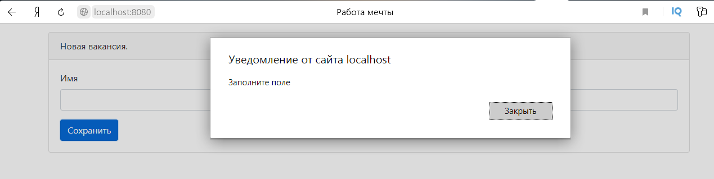

# Проект - Dream job

# Содержание
* [Использованные технологии](#Использованные-технологии)
* [О проекте](#О-проекте)
* [Сборка](#Сборка)
* [Использование](#Использование)
* [Контакты](#Контакты)
## Использованные технологии
* Servlets, JSP
* PostgreSQL
* Collections Framework
* Apache Commons DBCP (Database Connection Pooling)
* Apache Commons FileUpload
* SLF4J и Log4j
* Mockito
* Библиотека GSON
* JSTL, Scriplets
* HTML, CSS
* JS, JQuery, Bootstrap
* Travis CI
## О проекте
* Данное приложение с web-интерфейсом представляет собой биржу работы:  
  
* Пользователь может быть как кандидатом так и HR. Кандидаты могут вносить в систему данные о себе:  
  
* HR могут публиковать вакансии о работе:  
  
* Проект построен на сервлетах и JSP. Есть 2 слоя: слой контроллеров (реализованный на сервлетах) 
и слой по работе с БД PostgreSQL (реализован на JDBC, также есть возможность хранить данные в памяти с помощью класса MemStore) 
* В проекте используется шаблон MVC. Все виды открываются через GET-методы сервлетов, что позволяет отправлять необходимые данные на виды, 
представленные JSP-страницами 
* Для реализации логики отображения на JSP-страницах используются Scriplets и JSTL. 
* JSP-страницы реализованы на HTML и Bootstrap.
* Реализована возможность добавления фото для кандидата, которое после добавления можно также скачать:  
  
  
  
* Только авторизованные пользователи могут просматривать списки вакансий и кандидатов, 
а также добавлять новые вакансии и кандидатов. Авторизация построена на основе фильтра (класс AuthFilter) 
и сервлета, выполняющего проверку пароля на соответствие данным из БД (класс AuthServlet). Все зарегистрированные пользователи 
хранятся в БД. Форма авторизации:  
  
* Добавлена возможность регистрации новых пользователей. Данная функция реализуется сервлетом RegServlet,
 который сохраняет новых пользователей в БД. Форма регистрации:  
  
* В качестве системы логирования используется связка log4j и slf4j. 
* Для работы с JSON-форматом используется библиотека GSON 
* Пул соединений к БД основан на Apache Commons DBCP 
* Для отображения авторизованного пользователя на всех страницах используется объект Session:  
  
  
* С помощью JS и JQuery сделана валидация всех форм приложения:  
  
* Для отображения списка городов на странице добавления и редактирования кандидатов используется технология AJAX 
(посылается AJAX-запрос с помощью JQuery на сервлет CityServlet):  
 
## Сборка
1. Установить JDK 14.
2. Скачать Maven.
3. Создать переменные окружения JAVA_HOME и M2_HOME и прописать в переменную окружения Path 
пути до бинарных файлов для JDK и для Maven:  
  
4. Установить сервер БД PostgreSQL. При установке задать: 
    * имя пользователя - postgres 
    * пароль - root
    * порт - 5432 
Также при установке сервера БД PostgreSQL нужно установить программу pg_Admin.

5. Скачать и установить Tomcat.
6. Скачать исходный код проекта с GitHub.
7. Перейти в корень проекта, где лежит файл pom.xml:  
  
  
8. С помощью Maven осуществить сборку проекта:  
  
При успешной сборке должна появиться папка target, в которой располагается war-архив:  
  
  
  
9. Переименовать war-архив:  
  
10. Запустить сервер БД, указав путь до папки data:  
  
11. Запустить программу pg_Admin, установленную вместе с сервером БД PostgreSQL:  
  
12. Создать БД с названием dreamjob:  
  
13. Открыть Query Tool для созданной БД и запустить SQL-скрипт schema.sql, 
находящийся в папке db (данная папка находится в корне скачанного проекта):  
  
  
Если нужно задать другой список городов для кандидатов, то нужно сделать это до запуска SQL-скрипта schema.sql 
в следующих строчках скрипта:  
  
14. Задеплоить собранный war-архив в папку webapps, находящуюся в корневой папке скачанного Tomcat:  
  
15. Скопировать файл db.properties, находящийся в корне скачанного проекта в папку bin, 
находящуюся в корневой папке скачанного Tomcat:  
  
  
Сборка завершена. Теперь можно проверить работу приложения.
## Использование
Запускаем Tomcat:  
  
  
Переходим на главную страницу приложения 
[http://localhost:8080/dreamjob/](http://localhost:8080/dreamjob/):   
  
При попытке просмотреть список доступных вакансий нас перекидывает на форму авторизации, что означает, 
что с приложением могут работать только авторизованные пользователи. То же самое произойдёт при попытках 
просмотреть список кандидатов и добавить новые вакансии или кандидатов:  
  
Сейчас в БД нет зарегистрированных пользователей, поэтому  сначала зарегистрируемся:  
  
Теперь можно авторизоваться:  
  
  
Добавим кандидата:  
  
  
Отредактируем добавленного кандидата (нажимаем на значок перед именем):  
  
  
Добавим фото для добавленного кандидата:  
  
  
Скачаем добавленное фото:  
  
  
Добавим вакансию:  
  
  
Отредактируем добавленную вакансию:  
  
  
Валидация работает на всех формах приложения, даже на форме добавления фото:  
 
## Контакты
Почта: studentnstu97@mail.ru 
Skype: live:.cid.9cdc925fb48220b4